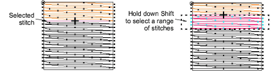
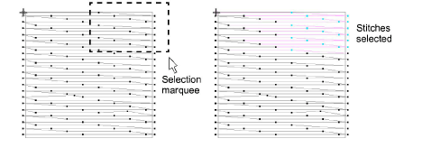

# Select stitches by needle point

|              | Use Stitch > Stitch Edit to select individual stitches for editing.            |
| ---------------------------------------------------- | ------------------------------------------------------------------------------ |
|  | Click View > Show Needle Points to show or hide the needle points in a design. |

Select individual stitches in Stitch Edit mode.

## To select stitches by needle point...

- Click the Stitch Edit icon and zoom into the area you want to edit.
- Click Show Needle Points for easier selection.
- Click a needle point.

- Use keyboard shortcuts to aid selection:
- To select a range, hold down Shift as you select.
- To select multiple stitches, hold down Ctrl as you select.
- Alternatively, drag a selection marquee around stitches.

- Deselect by either means:
- Press Esc.
- Select Edit > Deselect All.

Tip: While editing stitches, use the Selects On/Off command to select stitches while traveling.

## Related topics...

- [Select stitches while traveling](Select_stitches_while_traveling)
