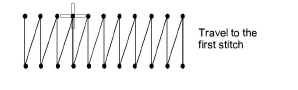
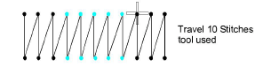

# Select stitches while traveling

|          | Use Stitch > Stitch Edit to select individual stitches for editing.                            |
| ---------------------------------------------------------- | ---------------------------------------------------------------------------------------------- |
|  | Select Stitch > Selects On/Off to select a range of stitches as you travel through the design. |

Select a range of stitches by traveling by stitch with Selects On/Off activated. This command adds stitches to the selection as you travel through the stitching sequence.

## To select stitches while traveling...

- Click the Stitch Edit icon.
- Zoom into the area you want to edit and click a needle point.

- Select Stitch > Selects On/Off or press Q.
- Travel through the design using arrow keys or Travel tools. As you travel, stitches are added to the selection.

- Press Q again to toggle off stitch selection.

## Related topics...

- [Travel through designs](../../Basics/view/Travel_through_designs)
