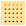
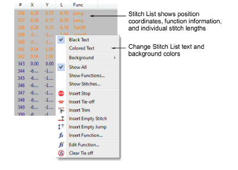
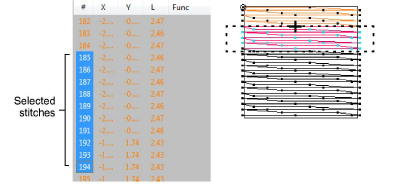

# Select stitches with the Stitch List

|  | Use Docker > Stitch List to toggle Stitch List display on and off. Use it to select individual stitches. |
| ---------------------------------------- | -------------------------------------------------------------------------------------------------------- |

You can view and select individual stitches by means of the Stitch List.

## To select stitches with the Stitch List...

- Click the Stitch List icon.

The Stitch List opens. It shows stitch position coordinates and function information – e.g. whether the stitch is a [jump](../../glossary/glossary#jump). It also shows the length of every stitch in the design.

- Right-click to access popup menu options. For example, display text in black by selecting Black Text or in the associated stitch color by selecting Colored Text.
- Click a stitch to select it. Stitches selected in the Stitch List are also selected in the design, and vice versa.

- Use keyboard shortcuts to aid selection:
- To select a range, hold down Shift as you select.
- To select multiple stitches, hold down Ctrl as you select.

## Related topics...

- [Filtering stitches & functions](Filtering_stitches_functions)
