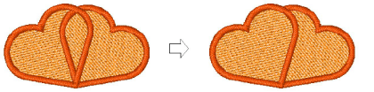
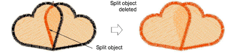

# Splitting objects

|  | Use Travel > Travel by Segment to move stitch cursor to the next/previous segment. Left/right click.              |
| -------------------------------------------------- | ----------------------------------------------------------------------------------------------------------------- |
|      | Use Travel > Travel 1 Stitch to move stitch cursor forwards/backwards 1 stitch at a time. Left/right click.       |
|          | Use Stitch > Split Object to split object in two at current needle position. Use with Travel by Stitch functions. |

Use the Split Object command to split most embroidery objects. Run objects may also be split but [Complex Fill](../../glossary/glossary) and Complex Turning objects may not.

## To split objects...

- Use the Travel by Segment or Travel by Stitch functions to move to the stitch where you want to split the object. [See also Travel through designs.](../../Basics/view/Travel_through_designs)
- Select Stitch > Split Object.

Tip: You can convert any split [manual objects](../../glossary/glossary) to outline objects with Process Stitches.

## Related topics...

- [Adjusting stitch densities](../../Quality/quality/Adjusting_stitch_densities)
- [Travel through designs](../../Basics/view/Travel_through_designs)
- [Converting stitches to objects](Converting_stitches_to_objects)
