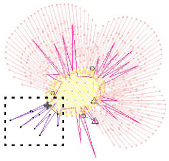

# Stitches & Machine Functions

EmbroideryStudio automatically generates stitches from design outlines and properties. This means you can [scale](../../glossary/glossary), transform, and reshape native designs without compromising stitch density or quality. However, EmbroideryStudio also lets you edit individual stitches. You may need to do this, for example, when working with ‘stitch’ files which do not contain outline data.

Like stitches, [machine functions](../../glossary/glossary) are inserted automatically whenever you digitize objects and specify [object properties](../../glossary/glossary#object-properties). They are stored with the embroidery object and updated whenever it is modified. However, EmbroideryStudio also lets you manually insert machine functions. This flexibility allows you to adapt designs to almost any machine requirement. [See Machine Files for details.](../../Production/convert/Machine_Files)

Occasionally you may need to digitize individual stitches. Use these sparingly.

You can also use manual stitching together with machine functions to create boring holes. Holes are cut in the fabric, producing an effect similar to lace.

## Related topics...

- [Selecting & editing stitches](Selecting_editing_stitches)
- [Splitting objects](Splitting_objects)
- [Editing machine functions](Editing_machine_functions)
- [Filtering stitches & functions](Filtering_stitches_functions)
- [Digitizing manual stitches](Digitizing_manual_stitches)
- [Converting stitches to objects](Converting_stitches_to_objects)
