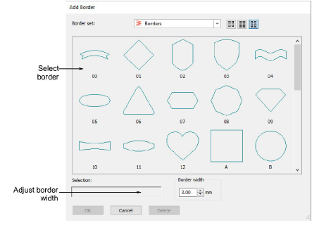

# Add design borders

|  | Use Toolbox > Add Borders to add borders to designs (or selected objects) with or without lettering. |
| -------------------------------------- | ---------------------------------------------------------------------------------------------------- |

Add decorative borders such as rectangles, ovals, and shields to designs or selected objects using the Borders library.

## To add decorative borders to designs...

1. Open a design and click the Add Borders icon.

::: tip
By selecting individual objects, you can add borders to these rather than the entire design.
:::

2. Select a border and adjust Border Width as required. The default is 3.00 mm.

3. Click OK.

4. Edit borders in the normal way – change thread color, adjust border size, etc.

::: tip
By default, borders scale proportionally. To resize proportionally around a central anchor point, hold down Shift as you drag. To scale freely in vertical and horizontal planes, hold down Ctrl as you drag.
:::
