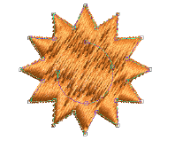
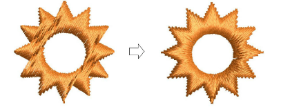

# Add & remove holes

|        | Use Graphics Digitizing > Hole > Add Holes to cut holes in filled objects.           |
| ------------------------------------------ | ------------------------------------------------------------------------------------ |
|  | Use Graphics Digitizing > Hole > Remove Holes to remove holes from selected objects. |

With EmbroideryStudio you can cut holes in selected closed objects with a single stitch angle using the Add Holes tool. The complementary Remove Holes tool allows you to remove unwanted holes in closed objects.

## To add or remove holes...

- Select the object to modify.
- Click the Add Holes icon. Reference points display around the object outline.
- Digitize additional boundaries for the object. Press Enter after each boundary.

- Press Enter.
- Optionally, add turning stitch angles to the object.

::: info Note
To remove all internal boundaries from a closed object, select it and click Remove Holes.
:::

## Related topics...

- [Add holes to free-form shapes](../../Digitizing/input/Add_holes_to_free-form_shapes)
- [Removing underlying stitching](../../Quality/quality/Removing_underlying_stitching)
- [Adjusting stitch angles](../../Quality/quality/Adjusting_stitch_angles)
