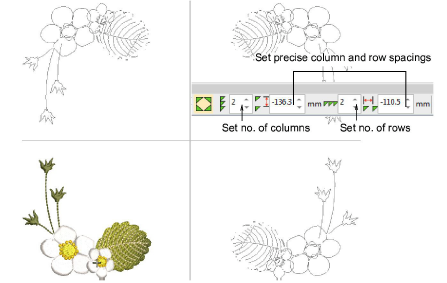
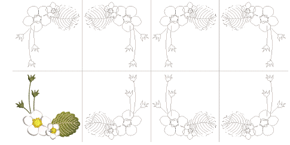

# Create multiple reflections

|  | Use Mirror Merge > Reflect to duplicate and mirror objects or designs. |
| ---------------------------------- | ---------------------------------------------------------------------- |

Use the Reflect tool to duplicate and mirror designs simultaneously. Set any number of rows or columns. The feature is often used in making fashion or textile designs. The limit for allowable wreath points is 100.

## To create reflected objects...

1Select the object or design.

2Click the Reflect icon. The associated settings are activated.

3Move the pointer to position duplicates.

Tip: Press Shift to disable Auto-Scroll while using Mirror Merge.

4Adjust the number of columns and rows required in the settings toolbar. Tab from field to field to enter values.

5For more precise positioning, adjust spacing settings. Press Enter to confirm.

6Click to mark the reflection point and press Enter to confirm.

Note: Color blocks are automatically resequenced to minimize unnecessary color changes.

## Related topics...

- [Duplicate & clone objects](../combine/Duplicate_clone_objects)
