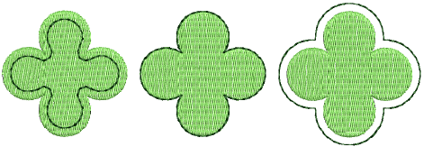
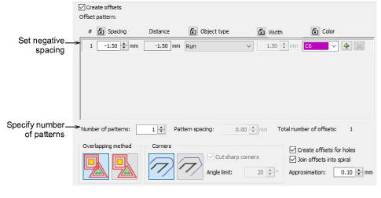
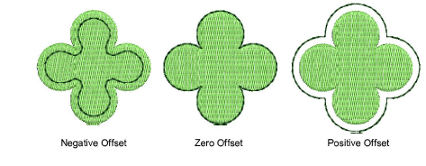
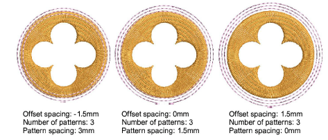
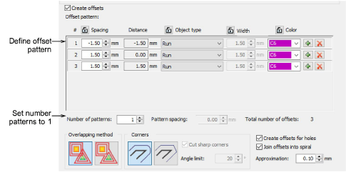

# Create negative offsets

|  | Use Toolbox > Outlines & Offsets to create outlines and offsets of any type for any filled embroidery or closed vector object. |
| ------------------------------------------------------------ | ------------------------------------------------------------------------------------------------------------------------------ |

The Outlines & Offsets tool allows you to specify both negative and positive offsets.

## To create negative offsets...

1Select a source object/s and click the Outlines & Offsets icon.

- Tick Create offsets and define a simple offset object in the Offset Pattern panel.
- Set the required offset in millimeters:
- To center the offset object over the original, enter a value of 0.00.
- To position the offset object outside the original, enter a positive offset – e.g. 1.00.
- To position the offset object inside the original, enter a negative offset – e.g. \-1.00.

- If you want multiple offsets, enter a value in the Number of patterns field.
- Select Pattern spacing and enter the required offset in millimeters. Offsets are always offset in a positive direction, even if you have entered a negative number. Spacing is calculated from the previous object, not the source object.

Note: As an alternative to the above technique, you can define your negative offsets entirely as a single offset pattern. Note how you set up the spacings.

