# Create outlines & offsets

|  | Use Toolbox > Outlines & Offsets to create outlines and offsets of any type for any filled embroidery or closed vector object. |
| -------------------------------------------------- | ------------------------------------------------------------------------------------------------------------------------------ |

Use the Outlines & Offsets tool to add outline stitching to selected objects or entire designs with a complete range of outline styles. Any closed shape can be used, including [vector objects](../../glossary/glossary), runs, or any filled shapes.

## Outlines

The Outlines & Offsets dialog divides into two panels for outlines and offsets. Use the outlines panel to generate outlines around single or multiple selected objects. The droplist includes the full range of outline stitch types. For each selected object, the software generates outlines and inserts them immediately after in the stitching sequence.

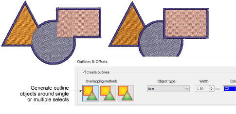

The Overlapping Method determines how outlines will overlap:

| Overlap method                                               | Details    |                                                           |
| ------------------------------------------------------------ | ---------- | --------------------------------------------------------- |
| 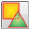 | Individual | All generated outlines are full outlines.                 |
| 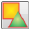         | Common     | Intersecting outlines are combined into a single outline. |
| 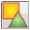       | Trimmed    | Overlapped portions are trimmed by overlapping objects.   |

## Offsets

The offsets panel allows you to generate single or multiple offsets in any combination of styles, colors, and spacings. Any closed shapes can be used, including [vector objects](../../glossary/glossary), runs, or any filled shapes. You have the option of preserving source objects.

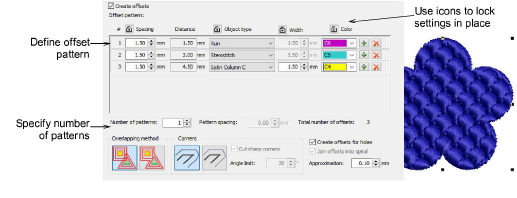

- Tick Create offsets and define an offset pattern in the Offset Pattern panel. Each row defines a single offset. For each, specify an object type – e.g. Run – a spacing in millimeters – e.g. 1mm – and a color. Remember that each spacing is calculated from the previous object.

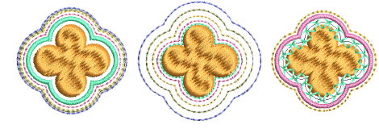

- Use the + buttons to add offsets to a pattern. Use the Lock icons to lock settings in place.
- Specify pattern repeats in the Number of patterns field. Adjust spacing between pattern repeats in the Pattern spacing field.

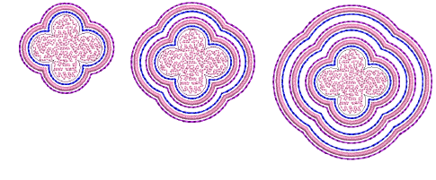

- Tick the Create offsets for holes checkbox as appropriate.

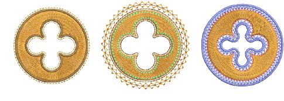

- Use the Overlapping method options to determine offsets for multiple selections.

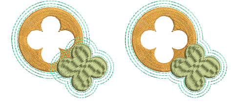

- Tick the Join offsets into spiral checkbox to create a continuous spiral around the source object.

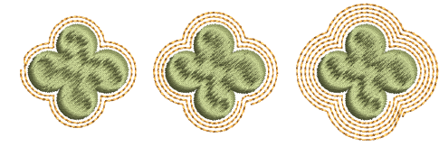

- Select rounded or squared corners as preferred. The squared option allows you to adjust the angle limit – first select Cut Sharp Corners and set required angle value.

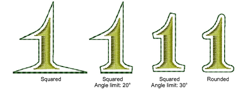

- Adjust the Approximation setting as required. This controls the smoothness of the generated object outline – the larger the value, the more approximate the curve. If the value is set to zero, the generated outline is unsmoothed. This is suitable for use with cutting machines.

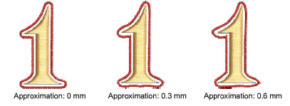

::: info Note
By default, source objects are preserved. If you choose not to, the offset object replaces the original in the same position in the stitching order. Start and end points of the resultant object will be as close as possible to those of the source object.
:::
