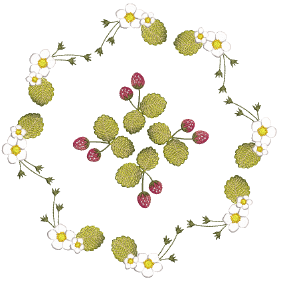
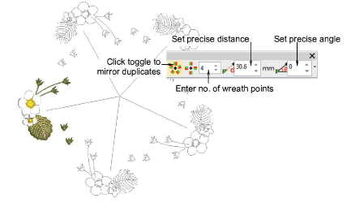
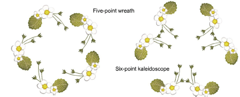

# Create wreaths

|              | Use Mirror Merge > Wreath to duplicate objects around a center point. |
| -------------------------------------------- | --------------------------------------------------------------------- |
|  | Use Mirror Merge > Kaleidoscope to mirror paired objects in a wreath. |

Use the Wreath tool to duplicate objects around a center point. The Kaleidoscope toggle mirrors the selection as well. Color blocks are automatically resequenced to minimize unnecessary color changes.

## To create wreaths...

1. Select the object or design.

2. Click the Wreath icon. The associated settings are activated.

3. Move the pointer. Optionally, click the Kaleidoscope toggle to mirror duplicates.

4. Enter the number of wreath points. Because objects are mirrored, Kaleidoscope works best with an even number.

5. Move the pointer to position duplicates. Hold down Ctrl to constrain the reference line to 45° increments.

6. For more precise positioning, adjust Distance and Angle settings. Tab from field to field to enter values. Press Enter to confirm.

Note: Distance and angle are measured from the center of the source to the center of the wreath or kaleidoscope.

7. Click to mark the reflection point and press Enter to confirm. The selection is duplicated and distributed around the center point.

Note: If the duplicates overlap the original, you are prompted to merge objects.
