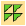
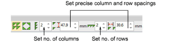
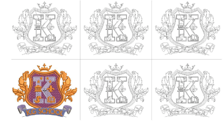

# Creating design arrays

|  | Use Mirror Merge > Array to duplicate designs, such as badges, re-sequencing color blocks for efficient multiple design stitchouts. |
| ------------------------------ | ----------------------------------------------------------------------------------------------------------------------------------- |

Use the Array tool to create multiple copies of designs, such as badges, spaced in rows and columns for faster stitchouts. Color blocks are automatically resequenced to minimize unnecessary color changes.

## To create design arrays...

- Select the object or design.
- Click the Array icon. The associated settings are activated.
- As you move the pointer, duplicate outlines move accordingly. Press Shift to disable Auto-Scroll while using Mirror Merge.
- Set the number of columns and rows. Tab from field to field to enter values.

- Move the pointer to position duplicates.

- Click to mark the anchor point or press Enter to confirm.

- Optionally, for more precise positioning, adjust spacing settings. Press Enter to confirm.
