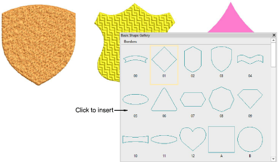

# Digitize basic shapes

|  | Use Graphics Digitizing > Basic Shapes to digitize basic shapes. Press &lt;Ctrl&gt; to maintain aspect ratio. Press &lt;Shift&gt; to center at the first point. |
| ------------------------------------------ | --------------------------------------------------------------------------------------------------------------------------------------------------- |

The Graphics Digitizing toolbar provides a dedicated Basic Shapes tool which allows you to quickly create design objects from a library of preset shapes. These can be created as vector objects, or you can apply the full range of outline and fill stitch types. These can be useful when creating logo designs or embroidered badges. Available shapes are exactly the same as for preset borders. Use Ctrl and Shift keys, alone or in combination, to maintain aspect ratio and center point.

## Related topics...

- [Reshaping embroidery objects](../reshape/Reshaping_embroidery_objects)
