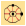
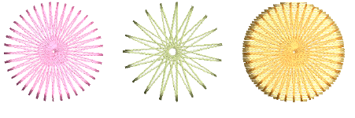
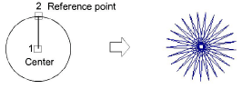
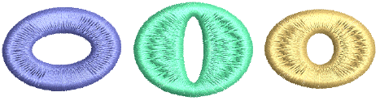
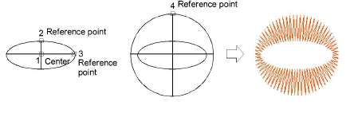
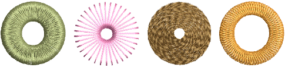

# Digitize stars & rings

|  | Use Traditional Digitizing > Star to digitize star shapes filled with Zigzag stitching. |
| ---------------------------- | --------------------------------------------------------------------------------------- |
|  | Use Traditional Digitizing > Ring to digitize circle and oval-shaped rings.             |

The Traditional Digitizing toolbar provides special time-saving tools for creating embroidered rings and stars or ‘French dots’.

## Stars

Digitize circles and ovals which use turning zigzag stitches to create a ‘Star’ or ‘French dot’ using the Star tool.

To digitize stars, click to mark the center and click again to set the radius. This point becomes the [entry point](../../glossary/glossary). To create an oval star, mark a second radius point, then press Enter.

## Rings

Create rings by digitizing circles and ovals within each other using the Ring tool. Use different combinations of inner and outer boundary shapes to create different effects.

To digitize rings, digitize the inner boundary of the ring first either as a circle or an oval. Digitize the outer boundary of the ring in the same way and press Enter.

You can digitize rings with a variety of fill stitch types. Contour stitch is well suited to rings, as it runs stitches around the ring in a spiral pattern.

## Related topics...

- [Reshaping stars & rings](../reshape/Reshaping_stars_rings)
