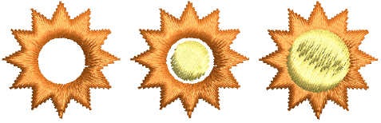
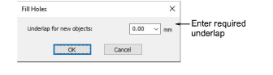
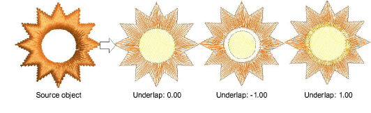

# Fill holes

|  | Use Graphics Digitizing > Hole > Fill Holes to fill holes formed by existing boundaries, without having to re-digitize the shape – choose to fill the hole exactly or offset it. |
| -------------------------------------- | -------------------------------------------------------------------------------------------------------------------------------------------------------------------------------- |

Create new objects with the Fill Holes feature. This lets you fill holes formed by existing boundaries, without having to re-digitize the shape.

## To fill holes...

1. Select a source object and click the Fill Holes icon.

2. Enter an underlap value.

- To cover holes exactly, accept the default value of 0.00.
- To leave a gap between the filled holes and the original object, enter a negative underlap – e.g. \-1.00.
- To overlap the filled holes and the original object, enter a positive underlap – e.g. 1.00.

3. Click OK. All newly created objects are filled with the current fill stitch settings, stitch angle and thread color. Each new object is an independent object and is placed immediately after the source object in the stitch sequence.
