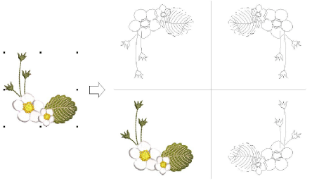
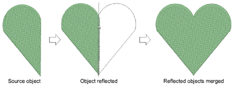

# Mirror selections horizontally & vertically

|    | Use Mirror Merge > Mirror Copy Horizontal to duplicate and mirror objects or designs in the horizontal plane.                  |
| ---------------------------------------------- | ------------------------------------------------------------------------------------------------------------------------------ |
|    | Use Mirror Merge > Mirror Copy Vertical to duplicate and mirror objects or designs in the vertical plane.                      |
|  | Use Mirror Merge > Mirror Copy Horizontal & Vertical to duplicate and mirror objects or designs simultaneously in both planes. |

Use the Mirror Copy Horizontal and Vertical tools to duplicate and mirror selections simultaneously. Simply select objects and click a tool to duplicate and mirror in any plane. Click to mark the reflection point and press Enter to confirm.

The Mirror Merge tools can also be used, as the name suggests, to merge mirrored objects into a single object. If duplicates overlap the original, you are prompted to merge objects. Use this feature to merge duplicates into a perfectly symmetrical object such as a face or heart.

## Related topics...

- [Create multiple reflections](Create_multiple_reflections)
- [Create wreaths](Create_wreaths)
- [Creating design arrays](Creating_design_arrays)
