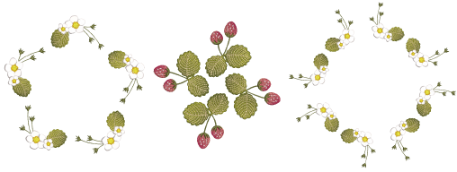

# Mirroring & reflecting selections

The Mirror Merge tools allow you to duplicate and transform selected objects, as well as merge them into a single object. Use them to create wreaths or decorative borders. Or use them to create perfectly symmetrical objects. Color blocks are automatically resequenced to minimize unnecessary color changes.

## Related topics...

- [Mirror selections horizontally & vertically](Mirror_selections_horizontally_vertically)
- [Create multiple reflections](Create_multiple_reflections)
- [Create wreaths](Create_wreaths)
