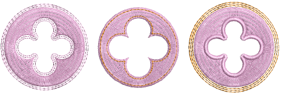
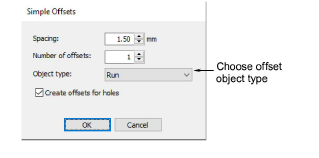
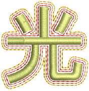

# Simple offsets

|  | Use Toolbox > Simple Offsets to create simple outlines for any filled embroidery or closed vector object. |
| ---------------------------------------------- | --------------------------------------------------------------------------------------------------------- |

When available, the Simple Offsets feature allows you to quickly create outline stitching around selected objects or entire designs with a variety of outline styles.

## To create outlines and borders...

1. Select a source object/s and click the Simple Offsets icon.

2. Adjust the settings as required:

| Option            | Function                                                                    |
| ----------------- | --------------------------------------------------------------------------- |
| Spacing           | Set an outline offset in mm. This may be zero or even a negative value.     |
| Number of offsets | Specify multiple outlines – up to 99.                                       |
| Object type       | Choice of outline object types: Run, Triple Run or Column C.                |
| Offsets for holes | Option to exclude or include outlines for any holes in the selected object. |

3. Click OK to apply settings. The design outline is stitched in the current palette color using current properties. Change settings as required.

::: tip
You can use Simple Offsets to create outlines around entire designs, including lettering.
:::
