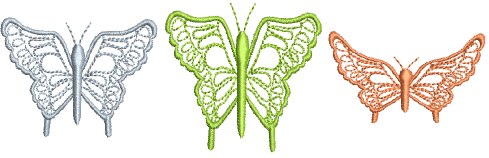
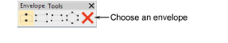
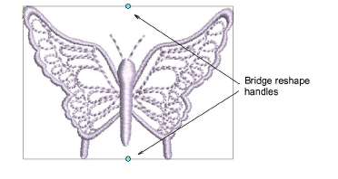
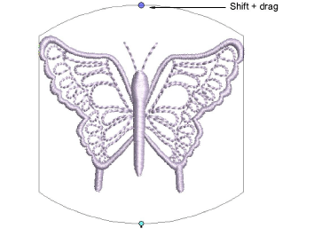
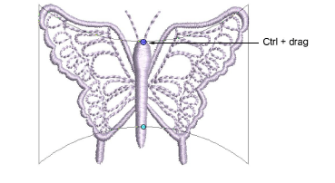

# Applying envelopes

|            | Apply Envelope > Bridge Envelope to make objects bulge or arch.      |
| ---------------------------------------------------------- | -------------------------------------------------------------------- |
|            | Apply Envelope > Pennant Envelope to make objects compress.          |
|  | Apply Envelope > Perspective Envelope to make objects stretch.       |
|          | Apply Envelope > Diamond Envelope to make objects bulge or compress. |

Four types of Envelope effect are available – Bridge, Pennant, Perspective and Diamond. Envelopes are typically applied to lettering objects, but they can also be applied to other types of embroidery object.

## To apply an envelope...

1. Select the lettering object you want to distort. To apply an envelope to several objects, group them first, then apply the envelope.

2. Select Edit > Envelope.

3. Select an envelope type from among the following alternatives:

Shaping handles display around the envelope outline.

4. Drag handles up or down to shape the object.

- To move two handles in opposite directions, hold the Shift key down while dragging.

- To move handles in the same direction, hold down the Ctrl key while dragging.

5. Press Esc to finish.

## Related topics...

- [Creating special effects with lettering art](../../Lettering/lettering_advanced/Creating_special_effects_with_lettering_art)
