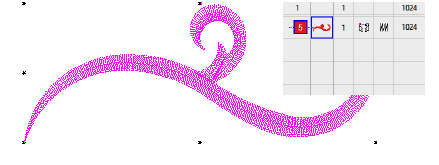
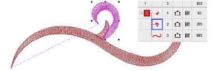

# Break apart composite objects

|  | Use Edit > Break Apart to split composite objects – monograms, appliqués, lettering, etc – into component objects. |
| ---------------------------------------- | ------------------------------------------------------------------------------------------------------------------ |

The Break Apart tool allows you to break up composite objects – monograms, appliqués, lettering, etc. The effect on these objects is similar to ungrouping.

::: info Note
When saved into earlier versions of the software, monograms, appliqués, lettering, and blackwork runs may be subjected to the Break Apart procedure by default.
:::

## To break apart a composite object...

1. Select the object you want to break apart – e.g. branched object, appliqué, monogram, lettering, etc.

2. Click the Break Apart icon or select Arrange > Break Apart. The branched object is split into component objects.

::: tip
To modify individual objects – e.g. to change the stitching sequence of monogram borders – use the Color-Object List to ungroup and resequence.
:::

::: tip
Applying the Break Apart function to a lettering object breaks it into a logical stitching sequence while maintaining lettering object characteristics.
:::

## Related topics...

- [Splitting objects](../functions/Splitting_objects)
- [Breaking apart lettering](../../Lettering/lettering_edit/Breaking_apart_lettering)
