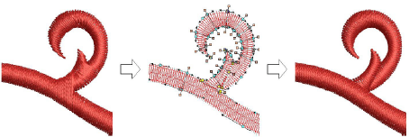

# Cut shapes automatically

|  | Use Edit > Automatic Knife to automatically slice Complex Fill and Complex Turning embroidery objects into smaller turning stitch and single angle objects with automatic overlaps. |
| ------------------------------------------------ | ----------------------------------------------------------------------------------------------------------------------------------------------------------------------------------- |

The Automatic Knife tool assists semi-automated digitizing of vector artwork. When objects have clean boundaries, EmbroideryStudio fragments them automatically and generates good quality stitching in most cases. It also operates on Complex Fill and Complex Turning embroidery objects.

## To cut shapes automatically...

1. Select one or more suitable objects for cutting.

2. Click the Automatic Knife icon.

EmbroideryStudio cuts the selected object automatically, discarding any unwanted fragments.

For each source object, EmbroideryStudio:

- Creates turning-stitch objects as well as single-angle objects where appropriate.
- Creates overlaps at junctions between objects.
- Branches adjoining objects.

## Related topics...

- [Automatic branching](../../Quality/connectors/Automatic_branching)
- [Break apart composite objects](Break_apart_composite_objects)
