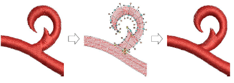
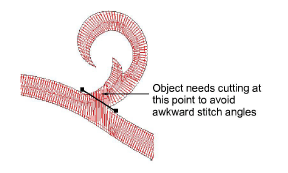
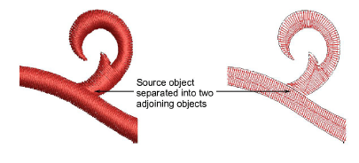
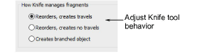
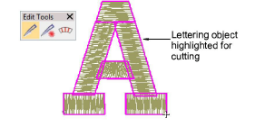

# Cut shapes manually

|  | Use Edit > Knife to cut objects along a digitized line, preserving stitch settings and colors in resulting objects. |
| ------------------------------ | ------------------------------------------------------------------------------------------------------------------- |

The Knife tool is used to manually cut filled shapes into smaller fragments. It has the advantage over Split Object and Divide tools of allowing you to digitize temporary cut lines. Cut objects are generated with stitching – parallel or turning – appropriate to their shape. The tool cuts both filled and ‘fillable’ vector objects as well as embroidery objects. Run objects can also be cut with the Knife tool.

The Knife tool has two modes of operation:

- With nothing selected, it will cut all objects under the knife.
- With selected objects, it will only cut those within the selection.

## To cut shapes manually...

1. Select one or more suitable objects for cutting.

2. Click the Knife tool. The cursor changes to a knife icon.

3. Digitize a cutting line – left-click for corner points, right-click for curve points – and press Enter.

4. Manually adjust object overlaps using the Reshape Object tool.

::: info Note
By default EmbroideryStudio orders fragments into a closest-join sequence that preserves the source object’s [entry ](../../glossary/glossary)and [exit](../../glossary/glossary#exit) points. The Options > Reshape dialog offers other ways of managing cut fragments.
:::

::: info Note
When you select a lettering object to cut, the object is highlighted with a thick magenta outline. [See Converting TrueType fonts to embroidery for details.](../../Lettering/lettering_custom/Converting_TrueType_fonts_to_embroidery)
:::

## Related topics...

- [Split vector & embroidery objects](Split_vector_embroidery_objects)
- [Shaping objects](Shaping_objects)
- [Reshape options](../../Setup/settings/Reshape_options)
- [Reshape objects with reshape-nodes](Reshape_objects_with_reshape-nodes)
