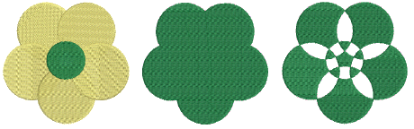
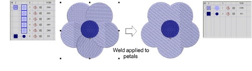
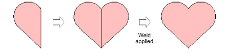
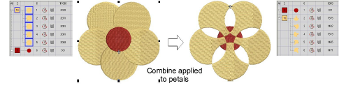
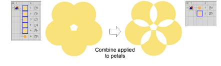
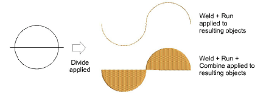

# Merge vector & embroidery objects

|        | Use Shaping > Weld to merge overlapping objects into a single ‘flattened’ object.                |
| -------------------------------------------- | ------------------------------------------------------------------------------------------------ |
|  | Use Shaping > Combine to merge the properties of overlapping objects and trim overlapping areas. |

Merge selected objects using the Weld or Combine tools.

## To merge vector and embroidery objects...

- Select vector or embroidery objects to shape.
- Use Weld to merge overlapping objects into a single ‘flattened’ object.

- Make symmetrical shapes by digitizing one half, duplicating and reflecting, then welding the duplicate shapes.

- Use Combine to convert embroidery objects into multiple objects sharing the [properties](../../glossary/glossary#properties) – stitch color and type, etc – of the topmost object.

If drawing tools are used as the input method, Combine converts vector objects to a single complex shape.

::: tip
Cut objects in half by drawing a line through them and applying Divide. Apply Combine to create closed objects or Weld to fuse two objects.
:::

