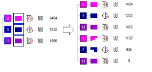

# Preserve original objects

|  | Use Shaping > Keep Original Objects to keep the source objects after shaping. |
| ------------------------------------------------------ | ----------------------------------------------------------------------------- |

The Keep Original Objects is a toggle which affects the behavior of all the other shaping tools. While it is active, all selected source objects of all shaping operations are preserved. The resultant objects are inserted after the last source object in the stitching sequence.

