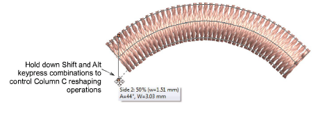

# Reshape Column C objects

|  | Use Reshape > Reshape Object to add stitch angles to selected objects. |
| -------------------------------------------------------- | ---------------------------------------------------------------------- |

Reshaping operations for Column C objects are handled a little differently to other embroidery objects.

- With the Reshape tool activated, drag reshape handles to control object width.
- Hold down Alt and drag to adjust offsets.
- Hold down Shift and drag to adjust angles.

## Related topics...

- [Digitizing regular columns](../../Digitizing/input/Digitizing_regular_columns)
- [Set angles & orientation](../../Digitizing/input/Set_angles_orientation)
- [Ruler & guide display options](../../Setup/settings/Ruler_guide_display_options)
