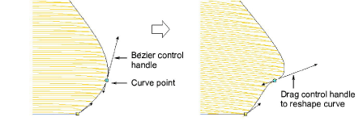
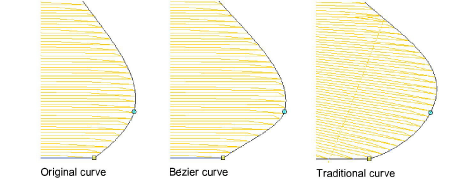

# Reshape objects with Bézier controls

|        | Use Reshape > Reshape Object to reshape selected objects by means of control points.                                |
| -------------------------------------------------------------- | ------------------------------------------------------------------------------------------------------------------- |
|  | Use Reshape Views > Show Reshape Nodes to toggle reshape-node display when using the Reshape Object tool.           |
|            | Use Reshape Views > Show Bézier Handles to toggle Bézier control handle display when using the Reshape Object tool. |

When EmbroideryStudio converts a vector graphic, it preserves nodes and control points. CorelDRAW® Graphics Suite uses [Bézier](../../glossary/glossary) curves. In Wilcom Workspace you can work with reshape-nodes or Bézier [control points](../../glossary/glossary).

## To reshape objects with Bézier controls...

1. Select an object and click Reshape Object. [Control points](../../glossary/glossary) appear together with Reshape Views toolbar.

2. Toggle on Show Reshape Nodes together with Show Bézier Handles.

3. Reshape objects in one of two ways:

- Drag the control handle to reshape the curve around reshape-nodes.

- Adjust reshape-node position by dragging along the outline.

Note: Generally, bézier node dragging preserves the shape of the curve more accurately.

4. Release the mouse and/or press Enter to finish. Again depending on system settings, stitches are generated as soon as the reshape-nodes are moved or after Enter is pressed.

Tip: Press Spacebar to toggle between corner and curve reshape-nodes.

## Related topics...

- [Reshape options](../../Setup/settings/Reshape_options)
