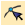
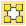
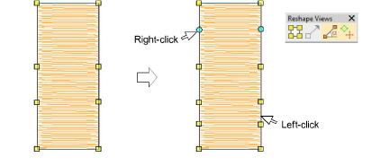
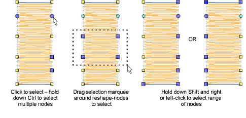
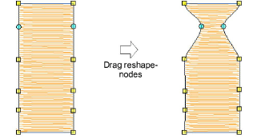
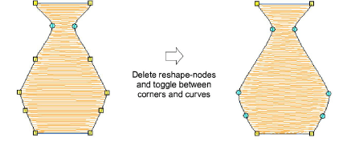

# Reshape objects with reshape-nodes

|        | Use Reshape > Reshape Object to reshape selected objects by means of control points.                      |
| -------------------------------------------------------------- | --------------------------------------------------------------------------------------------------------- |
|  | Use Reshape Views > Show Reshape Nodes to toggle reshape-node display when using the Reshape Object tool. |
|                    | Use View > Show Stitches to toggle embroidery stitching display on or off.                                |

Change object shapes with the Reshape Object tool.

## To reshape objects with reshape-nodes...

- Select an object and click Reshape Object. [Control points](../../glossary/glossary) appear together with Reshape Views toolbar.
- Toggle on Show Reshape Nodes and toggle off other icons.
- Optionally, press S to turn off stitch display and turn back on when you are ready to regenerate stitches.
- Add nodes as required:
- Left-click to add a corner node.
- Right-click to add a curve node.

- Select reshape-nodes as follows:
- Click a single node.
- Click-and-drag a selection marquee around a group of nodes.
- Use Ctrl or Shift keys to select multiple nodes. Left-clicking or right-clicking in closed shapes reverses the direction of the selection.

- Adjust reshape-node position by dragging along the outline.

::: tip
Use the arrow keys to ‘nudge’ selected nodes.
:::

- Press Delete to remove unwanted nodes.

- Press Spacebar to toggle between corner and curve nodes.
- Press Esc to cancel changes. Press Esc again to exit Reshape mode.

::: info Note
You can also adjust [stitch angles](../../glossary/glossary) as well as change entry and [exit points](../../glossary/glossary).
:::

## Related topics...

- [Reshape objects with Bézier controls](Reshape_objects_with_Bézier_controls)
- [Reshape options](../../Setup/settings/Reshape_options)
- [Adjusting stitch angles](../../Quality/quality/Adjusting_stitch_angles)
