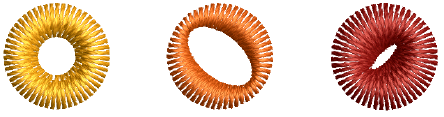
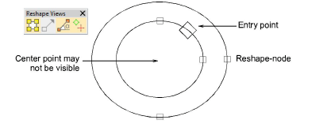
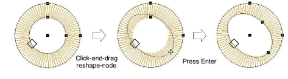
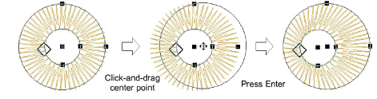

# Reshape ring objects

|  | Use Reshape > Reshape Object to reshape ring objects. |
| -------------------------------------------------------- | ----------------------------------------------------- |

You can reshape the inner and outer boundaries of ring objects with the Reshape Object tool.

## To reshape ring objects...

- Select an object and click Reshape Object.

- Use reshape nodes to change object radius, orientation, and position.

- Use reshape nodes to offset boundaries. Center points are generally on top of each other to begin with, and may not be visible.

## Related topics...

- [Digitize stars & rings](../productivity/Digitize_stars_rings)
