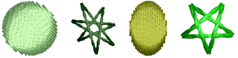

# Reshape star objects

|  | Use Reshape > Reshape Object to reshape circle and star objects. |
| -------------------------------------------------------- | ---------------------------------------------------------------- |

Change circle/star objects from circles to ovals using the Reshape Object tool.

## To reshape star objects...

- Select an object and click Reshape Object. Circle/star objects have two reshape-nodes (for radius and orientation), a center point (to reposition), and an [entry point](../../glossary/glossary#entry-point).

- Use reshape nodes to change object radius, orientation, and position.

::: tip
Change the stitch angle of circle objects by moving the [entry point](../../glossary/glossary#entry-point).
:::

- Press Enter.

::: tip
To [scale](../../glossary/glossary) a circle without changing it to an oval, select it with the Select Object tool, and use [selection handles](../../glossary/glossary#selection-handles).
:::

## Related topics...

- [Digitize stars & rings](../productivity/Digitize_stars_rings)
