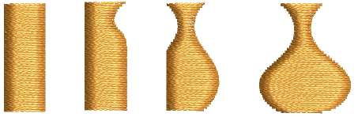

# Reshaping Objects

EmbroideryStudio offers a number of techniques for reshaping [embroidery objects](../../glossary/glossary#embroidery-objects), all with the one tool. Sometimes you may need to cut, split or break up complex or compound objects in order to fine-tune them. Various tools are available for this purpose. As well as reshaping object outlines, you can add and adjust [stitch angles](../../glossary/glossary), a property unique to embroidery objects. You can also change the [entry ](../../glossary/glossary)and [exit](../../glossary/glossary#exit) points of individual objects which is important if you are digitizing manually or resequencing embroidery objects.

## Related topics...

- [Reshaping embroidery objects](Reshaping_embroidery_objects)
- [Reshaping stars & rings](Reshaping_stars_rings)
- [Splitting objects](Splitting_objects)
- [Shaping objects](Shaping_objects)
