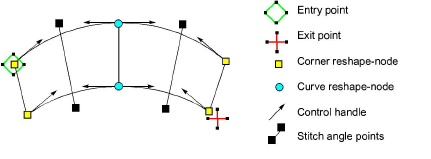

# Reshaping embroidery objects

The reference points you mark when digitizing a shape become its ‘[control points](../../glossary/glossary)’. Most control points can be added, deleted, or moved. Corner and curve points can be swapped. Some, such as [entry ](../../glossary/glossary)and [exit](../../glossary/glossary) points, cannot be deleted.

## Related topics...

- [View control points](View_control_points)
- [Reshape objects with reshape-nodes](Reshape_objects_with_reshape-nodes)
- [Reshape objects with Bézier controls](Reshape_objects_with_Bézier_controls)
- [Reshape Column C objects](Reshape_Column_C_objects)
