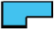

# Shaping tools summary table

| Source                                                                 | Tool                                   | Result                                               | Description                                                                                                                                                                                   |                                                                                                                                                     |
| ---------------------------------------------------------------------- | -------------------------------------- | ---------------------------------------------------- | --------------------------------------------------------------------------------------------------------------------------------------------------------------------------------------------- | --------------------------------------------------------------------------------------------------------------------------------------------------- |
|            |            | Weld                                                 |                                                                                                                                                     | Selected objects are combined into a single object. The resulting object takes the properties – stitch color and type, etc – of the topmost object. |
|                                      | Flatten                                |      | Only areas unique to each selected object are retained. All overlapping areas are removed.                                                                                                    |                                                                                                                                                     |
|                                  | Intersect                              |  | Only areas common to all selected objects are retained. All non-overlapping areas are removed.                                                                                                |                                                                                                                                                     |
|                                      | Exclude                                |      | Areas where pairs of selected objects overlap are removed, starting from the topmost object.                                                                                                  |                                                                                                                                                     |
|  |  | Front-Back                                           |                                                                                                                                           | The topmost object is retained, but all of the areas overlapping with other selected objects are removed.                                           |
|                                  | Back-Front                             |  | The bottommost object is retained, but all of the areas overlapping with other selected objects are removed.                                                                                  |                                                                                                                                                     |
|                                        | Divide                                 |        | The objects are split wherever overlaps occur and all hidden areas are removed.                                                                                                               |                                                                                                                                                     |
|                                      | Combine                                |      | Areas where pairs of selected objects overlap are removed, starting from the topmost object. All resulting objects share the properties – stitch color and type, etc – of the topmost object. |                                                                                                                                                     |
