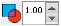
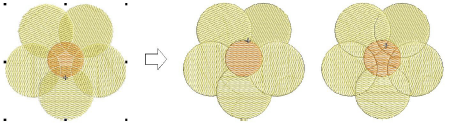
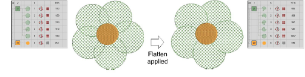
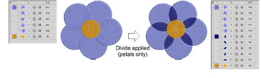
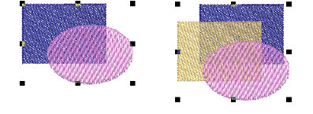
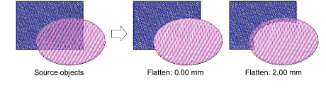
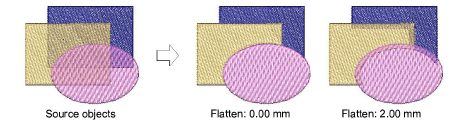

# Split vector & embroidery objects

|            | Use Shaping > Overlap to adjust the overlaps of objects resulting from Flatten or Divide shaping operations.                        |
| -------------------------------------------- | ----------------------------------------------------------------------------------------------------------------------------------- |
|  | Use Shaping > Flatten to trim all overlaps while retaining the original objects.                                                    |
|    | Use Shaping > Divide to split selected objects into separate adjoining objects wherever they intersect with other selected objects. |

Split selected objects using the Flatten or Divide tools. These tools preserve the outlines of the original shapes. The Overlap setting allows you to add overlaps to objects resulting from Flatten or Divide shaping operations.

## To split vector and embroidery objects...

- Select the vector or embroidery objects to shape.
- Click Flatten to trim all overlaps while retaining the original objects.

- Click Divide to split selected objects into separate adjoining objects. All overlapped areas become discrete objects.

- Use the Overlap feature to add overlaps to the objects resulting from Flatten or Divide shaping operations.

The Overlap range is from 0.00 to 5.00 mm with increments of 0.01 mm. The default overlap is 0.50 mm.

The border of a third object in the stitching order is extended where it touches the other two layers of objects. And so on.

