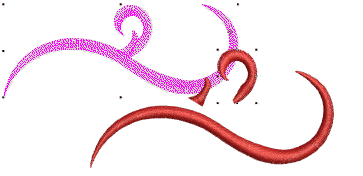

# Splitting objects

EmbroideryStudio lets you split [branched objects](../../glossary/glossary) – monograms, appliqués, lettering, etc – into their components. You can even split manual objects with Process Stitches in order to convert sections to outline objects.

## Related topics...

- [Break apart composite objects](Break_apart_composite_objects)
- [Cut shapes manually](Cut_shapes_manually)
- [Cut shapes automatically](Cut_shapes_automatically)
