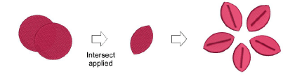
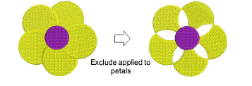
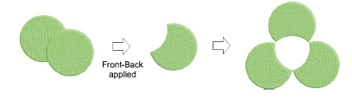
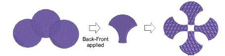

# Trim vector & embroidery objects

|  | Use Shaping > Intersect to trim overlapping areas so that only those intersected by all selected objects remain.        |
| ------------------------------------------------ | ----------------------------------------------------------------------------------------------------------------------- |
|      | Use Shaping > Exclude to trim overlapping objects and preserve their individual properties.                             |
|  | Use Shaping > Front-Back to trim overlapping objects so that only non-overlapped areas of the topmost object remain.    |
|  | Use Shaping > Back-Front to trim overlapping objects so that only non-overlapped areas of the bottommost object remain. |

Trim selected objects using the Intersect, Exclude, Front-Back or Back-Front tools.

## To trim vector and embroidery objects...

- Select vector or embroidery objects to shape.
- Use Intersect to trim overlapping areas so that only those intersected by all selected objects remain.

- Use Exclude to trim overlapping objects and preserve their individual [properties](../../glossary/glossary#properties). The result is similar to Combine except that object properties are not merged.

::: tip
Use Exclude to cut holes in Complex Fill objects.
:::

- Use Front-Back to trim overlapping objects so that only non-overlapped areas of the topmost object remain.

- Use Back-Front to trim overlapping objects so that only non-overlapped areas of the bottommost object remain.

::: tip
Use the Remove Overlaps feature to maintain shapes but remove the underlying layer of stitching.
:::

## Related topics...

- [Removing underlying stitching](../../Quality/quality/Removing_underlying_stitching)
