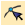
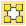
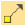
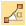
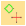
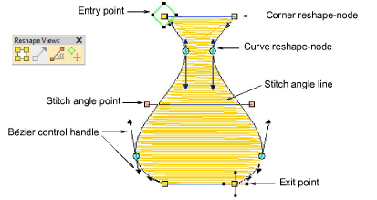
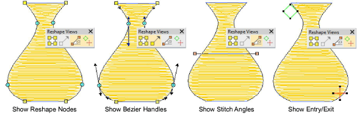
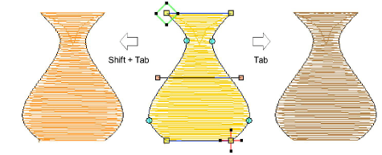

# View control points

|        | Use Reshape > Reshape Object to reshape selected objects, edit stitch angles, and adjust entry/exit points.                                             |
| ---------------------------------------------------- | ------------------------------------------------------------------------------------------------------------------------------------------------------- |
|  | Use Reshape Views > Show Reshape Nodes to toggle on/off reshape nodes for selected objects.                                                             |
|            | Use Reshape Views > Show Bézier Handles to toggle on/off Bézier handles for selected objects.                                                           |
|  | Use Reshape Views > Show Stitch Angles to toggle on/off stitch angles for selected objects.                                                             |
|        | Use Reshape Views > Show Entry/Exit Points to toggle on/off entry/exit points for selected objects – respectively, green diamond and red cross markers. |

The Reshape Object tool is important in EmbroideryStudio. Use it whenever you want to change object shapes. Use it also to edit stitch angles as well as [entry ](../../glossary/glossary)and [exit](../../glossary/glossary#exit) points.

## To view control points...

- Select an object and click Reshape Object. [Control points](../../glossary/glossary) appear together with Reshape Views toolbar.

::: tip
Most control points can be added, deleted, or moved. Corner and curve points can be swapped. [Entry/](../../glossary/glossary)[exit](../../glossary/glossary#exit) points, however, cannot be deleted.
:::

- Use the Reshape Views toolbar to selectively display control points.

- Show Reshape Nodes: Use hotkey combination Alt+N to toggle. [See Reshape objects with reshape-nodes for details.](Reshape_objects_with_reshape-nodes)
- Show Bézier Handles: [See Reshape objects with Bézier controls for details.](Reshape_objects_with_Bézier_controls) [See also Reshape options.](../../Setup/settings/Reshape_options)
- Show Stitch Angles: Use hotkey combination Alt+A to toggle. [See Adjusting stitch angles for details.](../../Quality/quality/Adjusting_stitch_angles)
- Show Entry/Exit: [See Adjust entry/exit points for details.](../../Quality/connectors/Adjust_entry_exit_points)
- To view next or previous objects, press Tab or Shift+Tab keys. Any changes to objects are confirmed.

## Related topics...

- [Reshape objects with reshape-nodes](Reshape_objects_with_reshape-nodes)
- [Reshape objects with Bézier controls](Reshape_objects_with_Bézier_controls)
- [Reshape options](../../Setup/settings/Reshape_options)
- [Adjusting stitch angles](../../Quality/quality/Adjusting_stitch_angles)
- [Smoothing curves](../../Automatic/vectors/Smoothing_curves)
