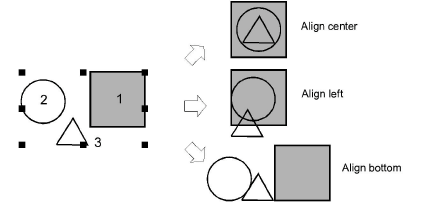

# Align objects

|                                | Use Arrange > Align Left to left-align selected objects.                                        |
| -------------------------------------------------------------------- | ----------------------------------------------------------------------------------------------- |
|      | Use Arrange > Align Centers Vertically to align the centers of selected objects vertically.     |
|                              | Use Arrange > Align Right to right-align selected objects.                                      |
|                                  | Use Arrange > Align Top to top-align selected objects.                                          |
|  | Use Arrange > Align Centers Horizontally to align the centers of selected objects horizontally. |
|                            | Use Arrange > Align Bottom to bottom-align selected objects.                                    |
|                          | Use Arrange > Align Centers to align selected objects through their centers.                    |

You can align selected objects to the left, right, top, bottom or center of a specified object.

## To align objects...

- Select the objects you want to align.
- Select the object you want to align with.
- Click an alignment tool or select Arrange > Align > ...

::: info Note
Objects are aligned with the last selected object. When all objects are selected using Ctrl+A or a selection marquee, they are aligned with the last object in the sequence.
:::

## Related topics...

- [Select objects with selection tools](../../Basics/basics/Select_objects_with_selection_tools)
