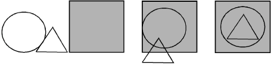

# Arranging objects

Position objects using the mouse to drag and drop, or ‘nudge’ them with arrow keys. Alternatively, specify X:Y coordinates in the Property bar. EmbroideryStudio also provides tools to align objects relative to each other, or distribute them evenly within the design.

## Related topics...

- [Position objects](Position_objects)
- [Align objects](Align_objects)
- [Distribute objects evenly](Distribute_objects_evenly)
