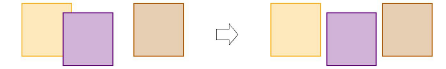

# Distribute objects evenly

|  | Use Arrange > Space Evenly Across to distribute selected objects evenly across the screen. |
| ------------------------------------------------------ | ------------------------------------------------------------------------------------------ |
|      | Use Arrange > Space Evenly Down to distribute selected objects evenly down the screen.     |

You can automatically distribute selected objects with even spacing between them, both vertically or horizontally.

## To distribute objects evenly...

- Select the objects you want to distribute.
- Click a spacing tool or select Arrange > Space Evenly > ...

::: info Note
The tools all become enabled when three or more objects are selected.
:::

## Related topics...

- [Select objects with selection tools](../../Basics/basics/Select_objects_with_selection_tools)
