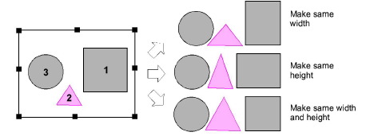

# Make objects the same size

|                    | Click Arrange > Make Same Width to scale an object or design to the same width as a reference object.           |
| ---------------------------------------------------------------- | --------------------------------------------------------------------------------------------------------------- |
|                  | Click Arrange > Make Same Height to scale an object or design to the same height as a reference object.         |
|  | Click Arrange > Make Same Width and Height to scale an object or design to the same size as a reference object. |

You can scale objects to the same size as a reference object. Resize height or width or both.

## To make objects the same size...

1. Select the objects to resize.

2. Select the object that is the size you require.

3. Click a sizing tool or select Arrange > Make Same Size > ...

::: info Note
Objects are resized with reference to the last object selected. If all objects are selected by using Ctrl+A or a selection marquee, they are resized with reference to the last object in the sequence.
:::
