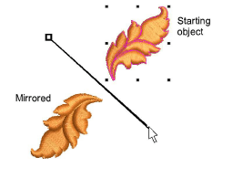

# Mirror objects around an axis

|  | Use Transform > Mirror by Reference Line to mirror objects around a defined axis using a reference line. |
| -------------------------------------------------------------- | -------------------------------------------------------------------------------------------------------- |

Use Mirror by Reference Line to mirror objects around a reference line.

## To mirror objects around an axis...

- Select the objects to mirror.
- Select the Mirror by Reference Line icon or select Edit > Transform > Mirror by Reference Line.

- Click to mark two reference points of the mirror axis.
- Press Ctrl to constrain the angle of the axis to 15° increments.
