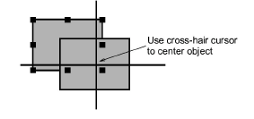
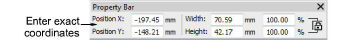

# Position objects

The simplest way to move an object is to drag-and-drop to a new position.

## To position objects...

- Select the objects to move and click-and-drag to a new position.

- For more accurate positioning, use the arrow keys to ‘nudge’ selected objects.

::: tip
With no objects selected, using arrow keys will travel through the design.
:::

- For even more accurate positioning, enter X:Y coordinates in the Property Bar. The selection is centered over the coordinates you set.

::: tip
Zoom in to make small adjustments. The distance the object moves depends on the current zoom factor.
:::

## Related topics...

- [Select objects with selection tools](../../Basics/basics/Select_objects_with_selection_tools)
