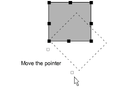

# Rotate objects by reference line

|  | Use Transform > Transform by Reference Line Freely to rotate selected objects with the aid of reference points alone. |
| -------------------------------------------------------------------------------- | --------------------------------------------------------------------------------------------------------------------- |

The Transform by Reference Line Freely tool lets you rotate selected objects with the aid of reference points alone. This technique is useful if you want to duplicate and rotate objects around an anchor point – e.g. the petals of a flower.

## To rotate an object by reference line...

1. Select objects to rotate.

2. Select Edit > Transform > Transform by Reference Line Freely.

3. Follow the prompt line:

- Click the first reference point. This becomes the anchor point for the rotation.
- Click a second reference point. An outline attaches to the pointer.

- Optionally, press Ctrl to constrain the angle of the axis to 15° increments.
- Click the anchor point. The pointer then aligns itself with the second reference point.
- Click a guide point for the required rotation position. Use coordinates on the Status bar for exact alignment.
