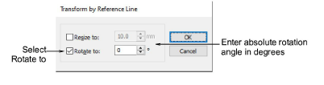
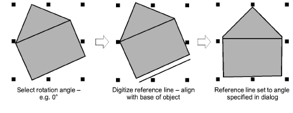

# Rotate objects by reference line and angle

|  | Use Transform > Transform by Reference Line Numerically to transform selected objects using a combination of reference points and numeric values. |
| ---------------------------------------------------------------------------------------------------- | ------------------------------------------------------------------------------------------------------------------------------------------------- |

The Transform tool provides another method for transforming selected objects using a combination of reference points and numeric values. This provides a very accurate technique for rotating selected objects.

## To rotate objects by reference line and angle...

1. Select the objects to rotate.

2. Decide which two points in the object or design will form the reference line. This should be a significant line – e.g. one which must be perfectly horizontal or vertical in the final design.

3. Select Edit > Transform > Transform by Reference Line Numerically.

4. Select the Rotate to checkbox, and enter the rotation angle of the reference line. For example, to rotate the image so it aligns with the horizontal axis, enter a value of 0°. The Angle field accepts angles from 0 to ±180 degrees.

5. Click OK.

6. Click to mark the start and end points of the reference line.

Press Ctrl to constrain the angle of the axis to 15° increments. Alternatively, press Enter twice to use a horizontal reference line by default.
