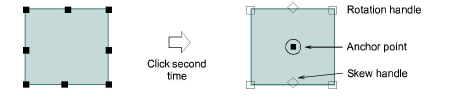
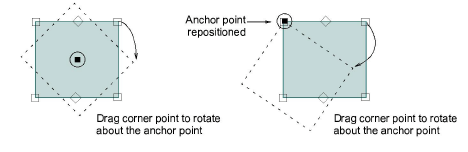

# Rotate objects interactively

When you select an object, [selection handles](../../glossary/glossary#selection-handles) display at its extremities. When you click the object again, the handles change to rotation handles. Use the tooltips as a guide.

## To rotate objects interactively...

1. Select the objects to rotate.

2. Click a second time. Rotation handles appear at the corners and an anchor point at the center.

3. Optionally, drag the anchor point to any position.

4. Click-and-drag a rotation handle in either direction.
