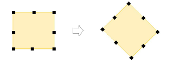

# Rotate objects numerically

|  | Click Transform > Rotate Right 15° to rotate selected objects by 15° in a clockwise direction.        |
| ---------------------------------------------- | ----------------------------------------------------------------------------------------------------- |
|    | Click Transform > Rotate Left 15° to rotate selected objects by 15° in a counter-clockwise direction. |
|                | Use Transform > Rotate to rotate selected objects by an exact amount (in degrees).                    |

You can rotate selected objects in 15° increments or by entering an exact value using the Transform toolbar.

## To rotate an object numerically...

- Select objects to rotate.
- To rotate in 15° increments, click one of the Rotate 15° icons.

- To rotate by an exact amount, enter an exact angle in the Rotate field and press Enter.
