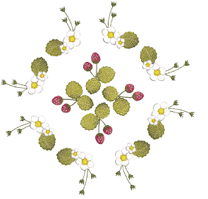

# Rotating objects

You can rotate objects directly on screen or by setting an exact rotation angle.

## Related topics...

- [Rotate objects interactively](Rotate_objects_interactively)
- [Rotate objects numerically](Rotate_objects_numerically)
- [Rotate objects by reference line](Rotate_objects_by_reference_line)
- [Rotate objects by reference line and angle](Rotate_objects_by_reference_line_and_angle)
