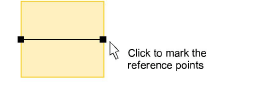
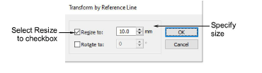

# Scale objects by reference line

|  | Use Transform > Transform by Reference Line Numerically to transform selected objects using a combination of reference points and numeric values. |
| ------------------------------------------------------------------------------------------ | ------------------------------------------------------------------------------------------------------------------------------------------------- |

You can scale an object or design by marking reference points and specifying a line length.

## To scale an object by reference line...

1. Select the objects or design to scale.

2. Select Edit > Transform > Transform by Reference Line Numerically.

You are prompted to enter start and end points. You will have already decided which two points in the object or design will form the reference line.

3. Click to mark the reference points. Press Ctrl to constrain the angle of the axis to 15° increments.

4. Alternatively, press Enter twice to use the default reference line. The Transform by Reference Line dialog opens.

5. Select the Resize to checkbox, and enter the required distance between reference points.

6. Click OK.
