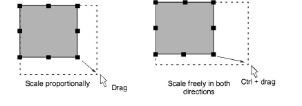
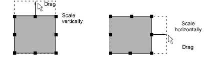
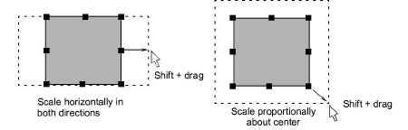

# Scale objects interactively

You can change height and width of an object, or scale it proportionally using [selection handles](../../glossary/glossary). Scale objects individually, or select multiple objects and scale them together. Use the tooltips as a guide.

## To scale objects interactively...

- Select the objects to scale.

- To scale height and width proportionally, use a corner handle.

Tip: By default, objects scale proportionally. To scale freely in vertical and horizontal planes, hold down Ctrl as you drag.

- To change the height or width, use the center handles.

- To scale proportionally around an anchor point, hold down Shift as you drag.

