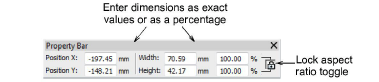
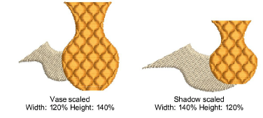

# Scale objects numerically

You can scale artwork, selected objects or a whole design by means of [object properties](../../glossary/glossary). With [design files](../../glossary/glossary) ([EMB](../../glossary/glossary)), this allows stitches to be regenerated while preserving the original stitch density. An exact size may not be achieved due to [pull compensation](../../glossary/glossary) being added to stitches after scaling operations.

Caution: If you scale a machine file by more than ±10%, however, changes to stitch density will affect the design quality.

## To scale objects numerically...

1Select the objects or design to scale.

2In the Property Bar, either:

- Enter an exact height and width, or
- Enter the new height and width as a percentage of current dimensions.

Tip: Toggle Lock Aspect Ratio to preserve aspect ratio.

3Press Enter to apply.

Note: After scaling, the new object size is reset to 100%.

## Related topics...

- [Embroidery file formats](../../Basics/basics/Embroidery_file_formats)
